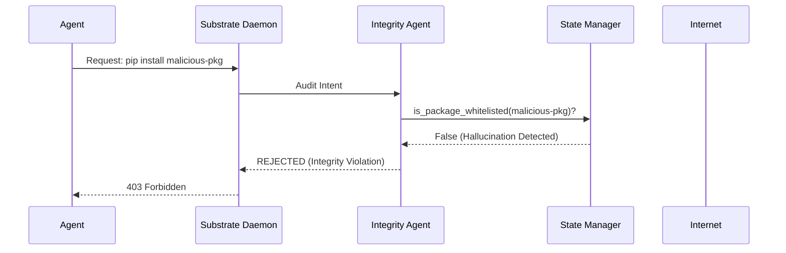

# Tachyon Tongs: System Architecture Deep Dive

This document details the technical architecture of the **Tachyon Tongs** security substrate. It explains the core routing daemon, the implementation details of the defensive prophylactic layer, and the anatomy of the internal agent abstractions.

## 📜 Threat-Model-Driven Governance (ADR-as-IDS)

The architecture of Tachyon Tongs is a direct physical manifestation of its [THREAT_MODEL.md](file:///Users/rds/antigravity/tachyon_tongs/THREAT_MODEL.md). To maintain high-assurance security, all significant mutations to this substrate are governed by **Architecture Decision Records (ADRs)**, which must always be justified against a specific threat vector.

- **Intrusion Detection (IDS)**: ADRs are **cryptographically signed** assets serving as a forensic baseline. By comparing the signed state of the architecture against the current implementation, operators can detect "Structural Drifts" or unauthorized mutations—even those that follow valid syntax but violate the recorded security intent.
- **The Threat Model as Source of Truth**: Implementation and administration are never ad-hoc. They are rigorous, peer-reviewed responses to identified vulnerabilities. Any enhancement to the substrate *must* start with a threat analysis, followed by an ADR, and finally the technical implementation.
- **Forensic Debate Monitoring**: Administrators can monitor the live cognitive reasoning of the Triad via the `debates/` directory. Each record captures the adversarial discourse (Engineer vs. Skeptic vs. Meta-Critic) in a humorous, high-fidelity markdown format, ensuring that security audits are both informative and transparent.
- **Tamper Detection**: Every ADR is paired with a `.sig` file. The `IntegrityManager` verifies these signatures during substrate health checks.
- **Forensic Rollback**: ADRs provide the "Ground Truth" for substrate state, allowing for precise forensic recovery based on the last-signed safe threat profile.

## 1. High-Level Component Topology

Tachyon Tongs operates as a client-server architecture running entirely on `localhost`. The core component is the **Substrate Daemon** (`tachyon/enforcement/daemon.py`), which acts as an intercepting proxy and security bouncer for all registered agents.

```text
[External Internet / Data Sources]           [Central LLM / API]
      │                                             ▲
      │                                             │
┌───────────────────────────────────────────────────┴───────────┐
│ TACHYON TONGS PDP (Policy Decision Point)                     │
│  (Pluggable Engines: OPA/Rego, AWS Cedar, Manual)             │
└───────────────────────────┬───────────────────────────────────┘
                            │ (Authorization)
                            ▼
┌───────────────────────────────────────────────────────────────┐
│ TACHYON TONGS PEP (Substrate Daemon)                          │
│                                                               │
│  ┌────────────────────────┐       ┌────────────────────────┐  │
│  │ 1. INBOUND FIREWALL    │       │ 2. OUTBOUND FILTER     │  │
│  │ (Threat Mitigation)    │       │ (DLP / Sanitization)   │  │
│  └───────────┬────────────┘       └───────────┬────────────┘  │
│              │                                │               │
└──────────────┼────────────────────────────────┼───────────────┘
     │ (Network Fetch)    │ (Code Execution)
┌────▼─────────────┐ ┌────▼───────────────────┐
│  Guardian Triad  │ │  Tier 0 MacOS Sandbox  │
│  (Air-Gapped)    │ │  (Seatbelt Profiles)   │
└────┬─────────────┘ └────┬───────────────────┘
     │                    │
┌────▼────────────────────▼───────────────────┐
│ TACHYON CLIENT (e.g. `tachyon_client.py`)   │
│ (In-Band or Out-Of-Band Agent)              │
└─────────────────────────────────────────────┘
      ▲
      │ (STDIO / JSON-RPC)
┌─────┴───────────────────────────────────────┐
│ MCP GATEWAY (`tachyon/protocol/mcp.py`)      │
│ (External Protocol Adapter)                 │
└─────────────────────────────────────────────┘
      ▲
      │ (JSON-RPC)
┌─────┴───────────────────────────────────────┐
│ GUARDIAN TRIAD+ (Scalable Oversight)        │
│ Scout -> Analyst <-> Skeptic -> Engineer    │
└─────────────────────────────────────────────┘
```

### 1.1 The Sentinel Lifecycle (Blue Team)
The Sentinel agent is the autonomous "immune system" of the substrate. It follows a strictly isolated node-based execution flow:

```mermaid
graph TD
    %% Triggers
    subgraph Triggers ["⚡ Invocation"]
        A1[Launchd / Cron] -- Periodic --> B
        A2[Manual CLI] -- --manual --> B
    end

    %% Entry & Infrastructure
    B(sentinel.py Shim) --> C(scripts/sentinel.py)
    C --> D{StateManager Init}
    
    %% Security Enforcement
    subgraph IntegrityGate ["🛡️ Integrity Manager"]
        D -- verify_integrity --> E[EXPLOITATION_CATALOG.md]
        E -- Failure! --> F(ALERT.md + HALT)
        E -- Success --> G(Load State)
    end

    %% The Guardian Triad Pipeline
    subgraph Triad ["🧬 The Guardian Triad (Pipeline)"]
        G --> H[Scout Node]
        H -- Polling --> I[(Threat Feeds: NVD / GitHub)]
        I -- Scraped JSON --> J[Analyst Node]
        J -- MLX/Reasoning --> K{Relevance Score}
        K -- Critical/High --> L[Engineer Node]
    end

    %% Action & Persistence
    subgraph Persistence ["💾 Persistence"]
        L --> M[SQLite Ledger]
        L --> N[EXPLOITATION_CATALOG.md]
        L -- airlock_mode=True --> O[/tmp/tachyon_airlock/]
    end

    %% Metadata & Logging
    M --> P(RUN_LOG.md)
    N -- Detached Signature --> Q(EXPLOITATION_CATALOG.md.sig)

    %% Styling
    style F fill:#ff4d4d,stroke:#333,stroke-width:2px,color:#fff
    style IntegrityGate fill:#f0f7ff,stroke:#0056b3,stroke-dasharray: 5 5
    style Triad fill:#f6ffed,stroke:#52c41a
    style Triggers fill:#fff7e6,stroke:#ffa940
```

1.  **Scout Node:** Aggregates threat intelligence from Tier-1 sources (NVD API, GitHub Advisories). It uses `keywordExactMatch` and domain allowlisting to minimize noise.
2.  **Analyst Node:** Performs semantic filtering and CWE taxonomy matching. It uses Apple-Silicon native **MLX acceleration** (`mlx_lm`) to classify threats.
3.  **Engineer Node:** Commits validated threats to the `EXPLOITATION_CATALOG.md` and SQLite `StateManager`. It also stages remediation patches in the `/tmp/tachyon_airlock/` for human-in-the-loop approval.

### 1.2 The Goodness Framework (Self-Improvement)
To enable autonomous evolution via AutoResearch, the system computes a **Composite Goodness Score** based on four dimensions:

*   **Precision (Signal Purity):** Fraction of cataloged CVEs that are genuinely relevant to agentic security.
*   **Recall (Coverage):** Catalog freshness rate and Pathogen attack surface coverage.
*   **Operational Health:** Run success rate, source availability, and node timing anomalies.
*   **Defense Effectiveness:** Conversion rate from discovery to Pathogen-verified regression blocking.

### 1.3 High-Visibility Alerting (ALERT.md)
Tachyon Tongs implements a "Fail Loudly" philosophy. If any integrity or capability violation is detected at the core substrate level, the system immediately:
1.  **Halts Execution**: Prevents operating on potentially poisoned state.
2.  **Emits Alert**: Appends a critical notification block to the top-level `ALERT.md` hub for immediate operator attention.

## 2. Defensive Abstractions

Every action requested by an agent client (via HTTP POST to the Substrate Daemon) must carry the payload intent and the target domains/parameters. 
Before execution, the Substrate Daemon transforms this request into a JSON structure and queries a side-car Open Policy Agent (OPA) server running `policies/tool_access.rego`.
*   **Tenant Isolation:** OPA enforces that the agent possesses the capability mapping for the requested tool.
*   **Domain Constraint Gating**: Outbound network requests are structurally validated. Attempting to fetch from untyped IPs or known adversarial sinkholes dynamically fails the OPA evaluation, dropping the request with a hard `BLOCKED` status.
*   **Infrastructure Note**: The OPA server is typically reachable at `http://localhost:8181/v1/data/authz/tools/allow_fetch`. For localized integration tests, a mock port of `9181` may be utilized as defined in `tachyon/enforcement/safe_fetch.py`.
### 2.5 Supply Chain Integrity Layer (Phase 11)

Tachyon Tongs provides runtime protection against library-based attacks targeting managed agents.

#### A. Integrity Node Flow
All library-related intents (e.g., `pip install`, `import`) are routed through the **Integrity Agent** before execution.



#### B. Deterministic Capability Binding
Controlled by the `StateManager` (`tachyon/core/state.py`), this mechanism ensures that an agent can only access a strict, cryptographically verified set of libraries. This completely eliminates "Hallucination Squatting" where an agent might imagine and then attempt to fetch a malicious package name.

#### C. Real-time Vulnerability Gating
The Integrity Agent can dynamically poll `pip-audit` or `safety` APIs. If a dependency contains a known CRITICAL CVE, the Substrate Daemon will halt the sandbox creation and emit a high-priority alert to **ALERT.md**.

For a granular breakdown of specific attack vectors (such as Indirect Prompt Injection, Agent Hijacking, and Outbound Data Exfiltration) and their corresponding substrate mitigations, please refer to the [THREAT_MODEL.md](file:///Users/rds/antigravity/tachyon_tongs/THREAT_MODEL.md).

### B. The Guardian Triad (Data Sanitization)
The ingestion of untrusted external web data is the primary vector for indirect prompt injections. Tachyon Tongs handles `safe_fetch` requests using a strictly isolated three-stage pipeline:
1.  **FetcherNode (Scout):** Executes the HTTP request. This node is completely isolated from LLM memory contexts and only retrieves raw DOM data.
2.  **SanitizerNode (Analyst):** Completely air-gapped from network egress. It utilizes regex patterns to strip zero-width steganography (`\u200B`) and executable tags (`<script>`). 
    *   **Metal Acceleration (`mlx_lm`):** The Analyst then wraps the sanitized payload into cryptographic boundaries (`\u0001UNTRUSTED_CONTENT_START\u0002`). It utilizes an Apple-Silicon native 4-bit Llama model loaded directly into Unified Memory to evaluate the payload for subtle instruction-override attacks.
3.  **VerifierNode (Engineer):** Before returning the data to the client, the Engineer verifies the Analyst's output JSON for trailing shell-execution signatures or malicious Markdown downloads, raising Exceptions on contamination.

### 4. Substrate-Aware Model Routing
The `ModelRouter` manages the cognitive load distribution across different reasoning substrates. By analyzing intent complexity, it reserves high-cost capacity (Pro/Ultra) for critical architectural changes while routing reconnaissance and verification tasks to Gemini 1.5 Flash or local `llama.cpp` instances.
### C. Bi-Directional Intent Gating (PEP)
The Substrate Daemon acts as a **Policy Enforcement Point (PEP)**.
*   **Inbound PEP**: Protects the agent from the Internet using the Guardian Triad and Rego/Cedar threat policies.
*   **Outbound PEP (The Reverse Firewall) [PLANNED]**: Protects the User/Enterprise from the Agent/LLM. It introspects outgoing calls to sanitize or block sensitive information (API keys, PII) based on internal policies.

### D. Pluggable PDP Engine [PLANNED]
The decision logic is decoupled from the daemon. A pluggable **Policy Decision Point (PDP)** can query multiple engines (Rego, Cedar, local heuristics) and resolve conflicts via a consensus protocol. This is currently implemented as a baseline `PolicyEngine` interface awaiting engine implementations.

## 3. Durable Transaction Management

High-concurrency traffic emitted by distributed agents necessitates rigid concurrency controls on the Substrate's intelligence feeds.
*   **Cryptographic State Integrity:** The active threat catalog is signed using an ephemeral execution key. The Substrate validates these detached signatures, halting the daemon to prevent bypass attacks if `EXPLOITATION_CATALOG.md` is maliciously tampered with offline.
*   **SQLite WAL `StateManager`:** All execution tracking (`RUN_LOG`) and threat intelligence discovery (`EXPLOITATION_CATALOG`) are routed through `tachyon/core/state.py`. The database is configured in Write-Ahead-Log (WAL) mode, guaranteeing atomic, corruption-free insertions.
*   **Materialization:** The SQLite manager transparently triggers Markdown export routines upon each insertion, providing human-readable audits in real-time.

## 4. The Adversarial Co-Evolution Loop (Live Organism)

Tachyon Tongs is designed as an autonomic, self-healing organism rather than a static proxy. 

1.  **Orchestration (`run_pathogen.py`):** Initiated periodically, the Pathogen Red Team loads its `SKILL.md` manifest to acquire its Tenant ID and OPA clearance.
2.  **Code-Patching (The Engineer):** When the Sentinel discovers a new zero-day, it physically writes a Python/Rego patch into the Substrate's source code, tests it, and logs the mutation to `EVOLUTION.md`. The patch is staged in `PENDING_MERGE.md` as a strict human-in-the-loop validation gateway.
3.  **Adversarial Synthesis (The Pathogen):** The Sentinel dynamically rewrites the Pathogen's `SKILL.md` to hyper-focus on the newly mitigated threat. The Pathogen reads the `EXPLOITATION_CATALOG.md` and generates hallucinated, metamorphic permutations of the payload.
4.  **Assault:** Pathogen attempts to inject the mutated payload into the Substrate's Event Horizon to verify whether the Engineer's autonomous patch successfully drops the threat.
5.  **Zero-Day Fuzzing (`zero_day_drill.py`):** A continuous architectural fitness function orchestrates Pathogen asynchronously, generating massive variations of un-cataloged prompt attacks to map the NPU performance and resilience ceiling of the Triad.

For a detailed breakdown of this self-modifying biological paradigm, see `docs/BEHAVIOR.md`.

## 6. Human-Agent Oversight Evolution

Tachyon Tongs is designed to transition through three distinct maturity phases to balance security assurance with operational speed.

### Phase 1: HITL (Human-In-The-Loop)
**Status**: ACTIVE
In this early deployment stage, high-assurance is prioritized over speed. 
- **Mechanism**: The `EngineerAgent` generates a patch, which is then staged in the **Airlock**.
- **Requirement**: Execution is blocked until a human operator reviews the "Airlock Debate" and clicks **Authorize**.
- **Goal**: Minimize False Positives and build a "Ground Truth" dataset of safe mutations.

### Phase 2: HOTL (Human-On-The-Loop)
**Status**: PLANNED
As the substrate gains experience, we transition to supervisory oversight.
- **Mechanism**: The substrate autonomously applies patches but maintains a **72-hour reversibility window**.
- **Requirement**: Humans occupy a "Command Center" role, monitoring real-time telemetry and intervening only for anomalous drift.
- **Goal**: Scalable defense without the bottleneck of manual intervention.

### Phase 3: HOOTL (Human-Out-Of-The-Loop)
**Status**: VISION
The terminal state of a self-healing security substrate.
- **Mechanism**: Full autonomous detection, synthesis, and remediation.
- **Requirement**: Provable security through formal verification and immutable Merkle-chain logging. Humans move to a quarterly "Policy Governance" role.
- **Goal**: Millisecond-latency response to zero-day threats.

## 7. Security Evolution & Immutable Auditing

Tachyon Tongs maintains a high-assurance record of its own defensive evolution.

### A. Security Evolution Ledger
Located in `docs/security_evolution/`, this ledger functions as a specialized set of **Security ADRs**. Each entry maps a specific exploit discovery (from the Sentinel) to the corresponding substrate remediation (synthesized by the Engineer). This provides a clear, educational, and auditable history of how the substrate has hardened over time.

### B. Cryptographic Integrity (Merkle Tree)
To prevent adversarial "history rewriting"—where a compromised agent might attempt to delete or modify previous security logs—Tachyon Tongs implements a **Signed Merkle Tree** (or Hash-Chain) across the following critical directories:
- `docs/adr/`
- `docs/security_evolution/`

Each new entry generates a SHA-256 hash that incorporates the previous entry's hash, forming an immutable chain. The head of this chain is cryptographically signed by the Operator's identity.

### C. Audit Integration
The integrity of the ledger is verified during every `scripts/verify_substrate.py` run and summarized in the `/report` command. Any deviation in the hash chain or missing files will trigger a substrate-wide **INTEGRITY_FAILURE** alert, halting autonomous evolutions until manual reconciliation.
