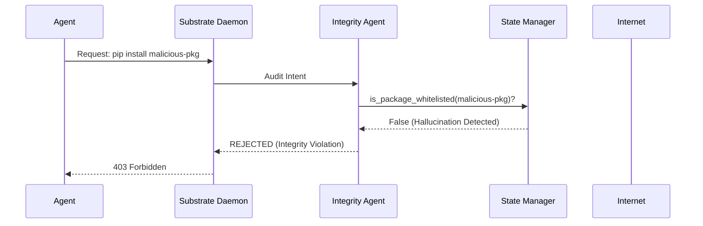
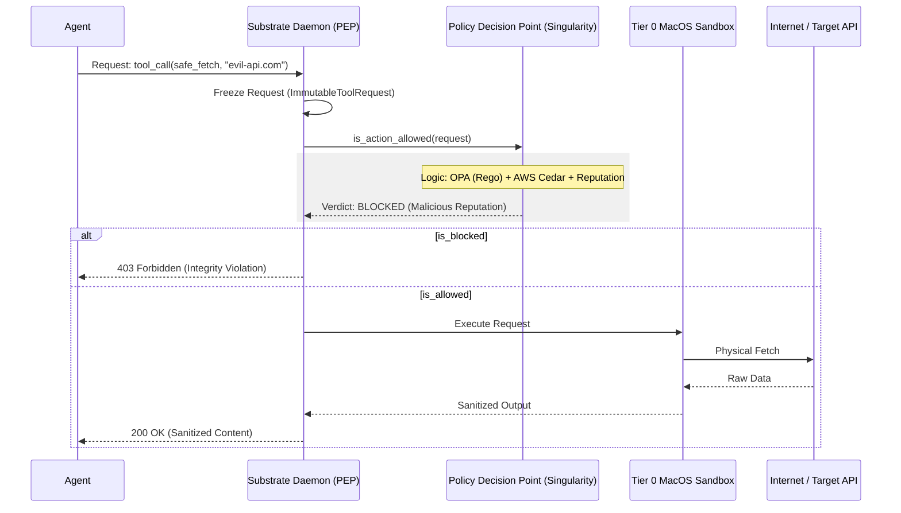
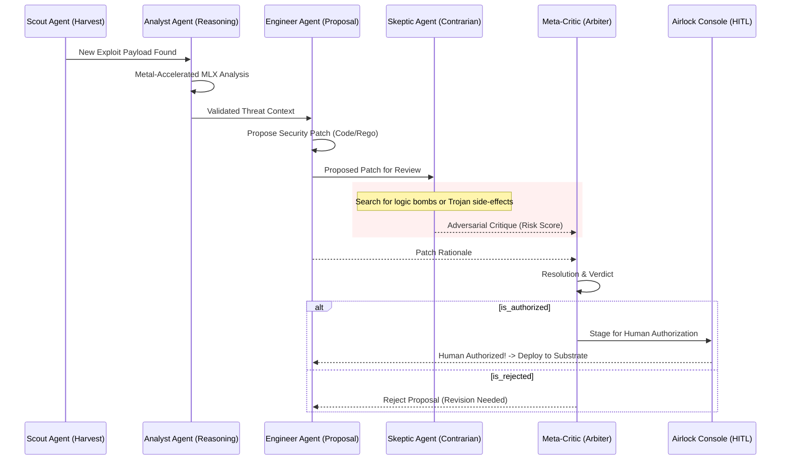
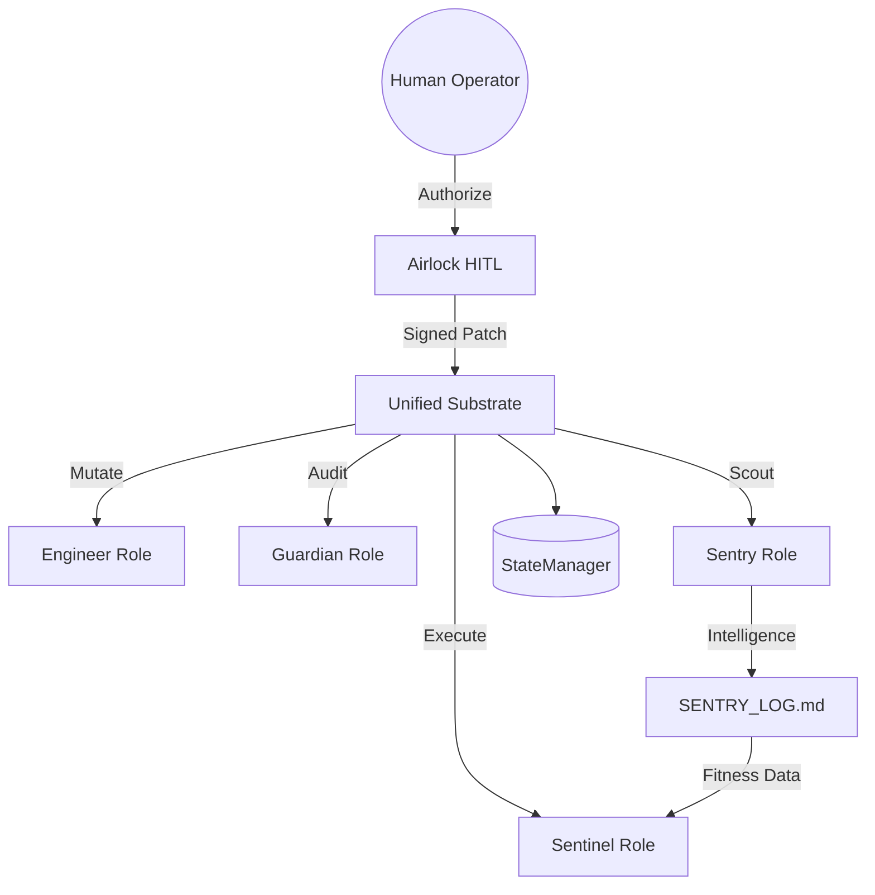
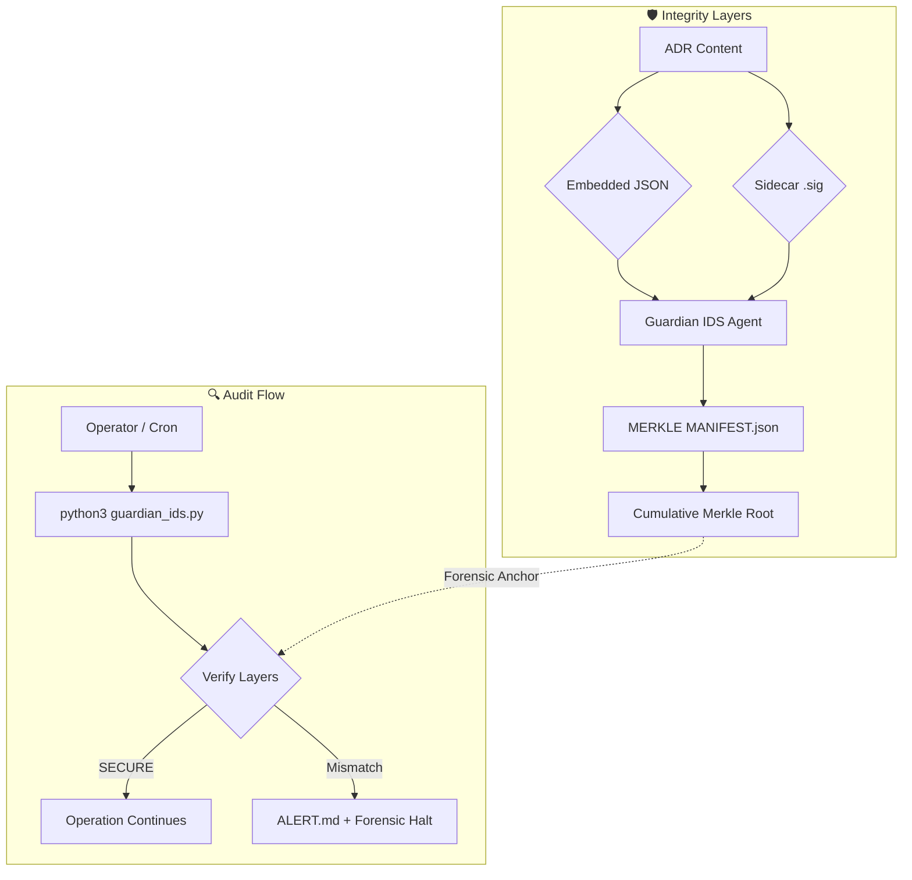
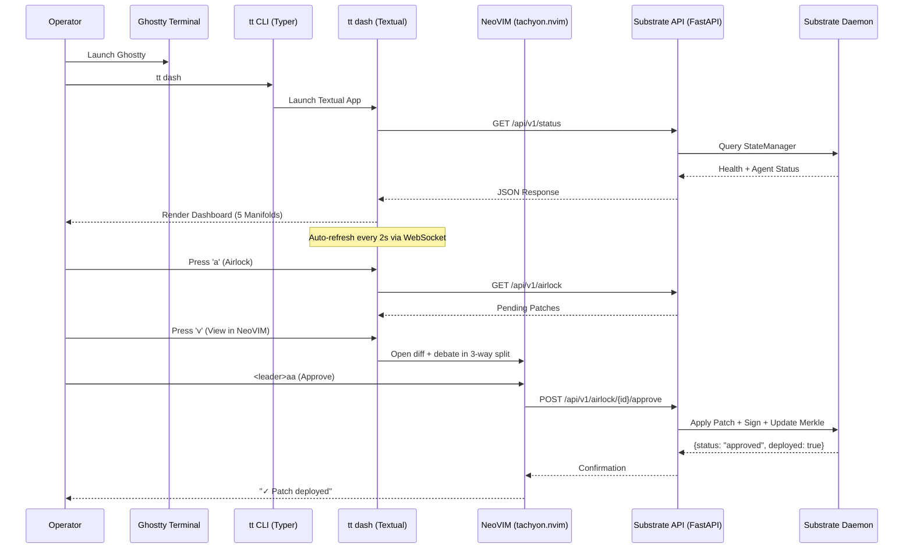
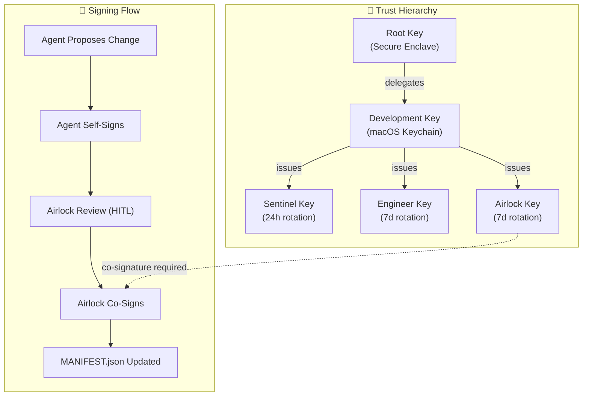

# Tachyon Tongs: System Architecture Deep Dive

This document details the technical architecture of the **Tachyon Tongs** security substrate. It explains the core routing daemon, the implementation details of the defensive prophylactic layer, and the anatomy of the internal agent abstractions.

## 📜 Threat-Model-Driven Governance (ADR-as-IDS)

The architecture of Tachyon Tongs is a direct physical manifestation of its [THREAT_MODEL.md](THREAT_MODEL.md). To maintain high-assurance security, all significant mutations to this substrate are governed by **Architecture Decision Records (ADRs)**, which must always be justified against a specific threat vector.

- **Intrusion Detection (IDS)**: ADRs are **cryptographically signed** assets serving as a forensic baseline. By comparing the signed state of the architecture against the current implementation, operators can detect "Structural Drifts" or unauthorized mutations. 
- **Agent Plugin Architecture (ADR-0033)**: The substrate is decoupled from agent logic. Agents reside in `agents/` and are categorized as **Code-Only**, **Skill-Only**, or **Hybrid**. They are discovered at runtime via the `AgentRegistry`.
- **Claw Compatibility (Phase 41)**: An interoperability layer that "wraps" external Claw agents in Tachyon's security boundaries, enforcing **Quarantine Mode** and strict capability gating.
- **Forensic Integrity**: Any structural drift or unauthorized mutation in the ADR history is detected as a Merkle violation.
- **Tiered Sovereignty (PQC Overlay)**: Critically, all high-assurance artifacts are signed by a **Hybrid Root**. This combines hardware-bound Ed25519 (Physical Sovereign) with ML-DSA-65 (Quantum Sovereign, NIST Level 3) to ensure future-proofed integrity. 
- **Deterministic Anchoring**: The PQC layer utilizes the **Expanded Secret Key** (4032 bytes) for hardware anchoring, ensuring that the public key remains deterministic across reloads from the macOS Keychain.
- **Out-of-Band Resilience**: Planned integration with a remote attestation service for the Merkle Root ensures detection even if the local repository is compromised.

## 1. High-Level Component Topology

Tachyon Tongs operates as a client-server architecture running entirely on `localhost`. The core component is the **Substrate Daemon** (`tachyon/enforcement/daemon.py`), which acts as an intercepting proxy and security bouncer for all registered agents.

```text
[External Internet / Data Sources]           [Central LLM / API]
      │                                             ▲
      │                                             │
┌───────────────────────────────────────────────────┴───────────┐
│ TACHYON TONGS PDP (Policy Decision Point)                     │
│  (Pluggable Engines: OPA/Rego, AWS Cedar, Manual)             │
└───────────────────────────┬───────────────────────────────────┘
                            │ (Authorization)
                            ▼
┌───────────────────────────────────────────────────────────────┐
│ TACHYON TONGS PEP (Substrate Daemon)                          │
│                                                               │
│  ┌────────────────────────┐       ┌────────────────────────┐  │
│  │ 1. INBOUND FIREWALL    │       │ 2. OUTBOUND FILTER     │  │
│  │ (Threat Mitigation)    │       │ (DLP / Sanitization)   │  │
│  └───────────┬────────────┘       └───────────┬────────────┘  │
│              │                                │               │
└──────────────┼────────────────────────────────┼───────────────┘
     │ (Network Fetch)    │ (Code Execution)
┌────▼─────────────┐ ┌────▼───────────────────┐
│  Guardian Triad  │ │  Tier 0 MacOS Sandbox  │
│  (Air-Gapped)    │ │  (Seatbelt Profiles)   │
└────┬─────────────┘ └────┬───────────────────┘
     │                    │
┌────▼────────────────────▼───────────────────┐
│ TACHYON CLIENT (e.g. `tachyon_client.py`)   │
│ (In-Band or Out-Of-Band Agent)              │
└─────────────────────────────────────────────┘
      ▲
      │ (STDIO / JSON-RPC)
┌─────┴───────────────────────────────────────┐
│ MCP GATEWAY (`tachyon/protocol/mcp.py`)      │
│ (External Protocol Adapter)                 │
└─────────────────────────────────────────────┘
      ▲
      │ (JSON-RPC)
┌─────┴───────────────────────────────────────┐
│ GUARDIAN TRIAD+ (Scalable Oversight)        │
│ Scout -> Analyst <-> Skeptic -> Engineer    │
└─────────────────────────────────────────────┘
```

### 1.1 The Sentinel Lifecycle (Blue Team)
The Sentinel agent is the autonomous "immune system" of the substrate. It follows a strictly isolated node-based execution flow:

```mermaid
graph TD
    %% Triggers
    subgraph Triggers ["⚡ Invocation"]
        A1[Launchd / Cron] -- Periodic --> B
        A2[Manual CLI] -- --manual --> B
    end

    %% Entry & Infrastructure
    B(sentinel.py Shim) --> C(scripts/sentinel.py)
    C --> D{StateManager Init}
    
    %% Security Enforcement
    subgraph IntegrityGate ["🛡️ Integrity Manager"]
        D -- verify_integrity --> E[EXPLOITATION_CATALOG.md]
        E -- Failure! --> F(ALERT.md + HALT)
        E -- Success --> G(Load State)
    end

    %% The Guardian Triad Pipeline
    subgraph Triad ["🧬 The Guardian Triad (Pipeline)"]
        G --> H[Scout Node]
        H -- Polling --> I[(Threat Feeds: NVD / GitHub)]
        I -- Scraped JSON --> J[Analyst Node]
        J -- MLX/Reasoning --> K{Relevance Score}
        K -- Critical/High --> L[Engineer Node]
    end

    %% Action & Persistence
    subgraph Persistence ["💾 Persistence"]
        L --> M[SQLite Ledger]
        L --> N[EXPLOITATION_CATALOG.md]
        L -- airlock_mode=True --> O[/tmp/tachyon_airlock/]
    end

    %% Metadata & Logging
    M --> P(RUN_LOG.md)
    N -- Detached Signature --> Q(EXPLOITATION_CATALOG.md.sig)

    %% Styling
    style F fill:#ff4d4d,stroke:#333,stroke-width:2px,color:#fff
    style IntegrityGate fill:#f0f7ff,stroke:#0056b3,stroke-dasharray: 5 5
    style Triad fill:#f6ffed,stroke:#52c41a
    style Triggers fill:#fff7e6,stroke:#ffa940
```

### 1.2 The Agent Collective (Modular Substrate)
Tachyon Tongs follows a **Logical Separation** pattern (ADR-0024) where each agent is a discrete "immune cell" with its own declarative Intent (`SKILL.md`) and substrate Implementation (`*_role.py`, `*_engine.py`).

Key organizational roles within the collective include:
- **The Firewall Administrator (LLM Agent):** The "Thinker" that provides macro-level architectural reasoning, leveraging `mlx_lm` locally to continuously observe traffic logs and govern substrate capabilities.
- **The Sentry (Unified Agent):** Handles both active vulnerability probing and passive semantic honeypotting for early intrusion detection.
- **The Healer (Somatic Agent):** The "Muscle" that coordinates autonomous remediation and substrate self-repair by listening for patch and violation signals.
- **The Herald (Custom Agent):** The "Mouth/Ear" that acts as the communication aggregator and deterministic command router, formatting complex telemetry for NeoVIM/CLI/Slack. Note: Signal integration was rejected due to transport complexity.

### 1.3 The Claw Ecosystem Bridge (Interoperability)
Tachyon Tongs implements a **Secure Import Pipeline** for Claw agents. This allows the substrate to "ingest" open-source agent specifications while re-wrapping them in the Tachyon security layer.
- **Format Mapping**: `SOUL.md` → `config.yaml` + `SKILL.md`, `HEARTBEAT.md` → `periodic_tasks`.
- **Enforcement**: Imported agents are automatically placed in **Quarantine Mode** (ADR-0034), restricting their capabilities to a non-destructive subset until manually graduated.
- **Vetting**: Every import triggers a 5-stage safety evaluation (Translation, Static Scan, Sandbox, Airlock, Quarantine).

---

## 3. Reliability & Resilience Patterns

Tachyon Tongs employs several high-assurance patterns to ensure substrate stability and deterministic behavior.

### 3.1 Event Sourcing & Heartbeat
- **Event Sourcing**: Every agent action is recorded as an immutable `AgentEvent`. This enables time-travel debugging and verifiable causality chains between agents.
- **Heartbeat Protocol**: Agents report liveness to a central `AgentHealthMonitor`. If a heartbeat is missed, the system initiates automated recovery handlers or escalates to a human operator.

### 3.2 Graceful Degradation (Capability Tiers)
The system operates across five capability tiers to ensure it never fails completely:
1.  **FULL_AUTONOMOUS**: All agents operational; autonomous patching enabled.
2.  **SUPERVISED**: Agents operational; HITL approval required for all mutations.
3.  **DETECTION_ONLY**: Alerting active; automated response disabled.
4.  **MANUAL_OVERRIDE**: All automation disabled; direct operator control only.
5.  **EMERGENCY_LOCKDOWN**: Read-only defensive posture; strict filtering enabled.

### 3.3 Circuit Breakers & WAL
- **Circuit Breakers**: Prevent cascading failures in agent-to-agent communication by opening the circuit after a threshold of failures, allowing services to recover.
- **Write-Ahead Log (WAL)**: Critical operations (e.g., patch application) are logged to a WAL before execution, guaranteeing atomicity and crash recovery.

---

For a complete alphabetical directory of all active agents and their forensic capabilities, see:
👉 **[AGENTS.md](AGENTS.md)**

---

### 1.3 The Goodness Framework (Self-Improvement)
To enable autonomous evolution via AutoResearch, the system computes a **Composite Goodness Score** based on four dimensions:

*   **Precision (Signal Purity):** Fraction of cataloged CVEs that are genuinely relevant to agentic security.
*   **Recall (Coverage):** Catalog freshness rate and Pathogen attack surface coverage.
*   **Operational Health:** Run success rate, source availability, and node timing anomalies.
*   **Defense Effectiveness:** Conversion rate from discovery to Pathogen-verified regression blocking.

### 1.3 High-Visibility Alerting (ALERT.md)
Tachyon Tongs implements a "Fail Loudly" philosophy. If any integrity or capability violation is detected at the core substrate level, the system immediately:
1.  **Halts Execution**: Prevents operating on potentially poisoned state.
2.  **Emits Alert**: Appends a critical notification block to the top-level `ALERT.md` hub for immediate operator attention.

## 2. Defensive Abstractions

Every action requested by an agent client (via HTTP POST to the Substrate Daemon) must carry the payload intent and the target domains/parameters. 
Before execution, the Substrate Daemon transforms this request into a JSON structure and queries a side-car Open Policy Agent (OPA) server running `policies/tool_access.rego`.
*   **Tenant Isolation:** OPA enforces that the agent possesses the capability mapping for the requested tool.
*   **Domain Constraint Gating**: Outbound network requests are structurally validated. Attempting to fetch from untyped IPs or known adversarial sinkholes dynamically fails the OPA evaluation, dropping the request with a hard `BLOCKED` status.
*   **Infrastructure Note**: The OPA server is typically reachable at `http://localhost:8181/v1/data/authz/tools/allow_fetch`. For localized integration tests, a mock port of `9181` may be utilized as defined in `tachyon/enforcement/safe_fetch.py`.
### 2.5 Supply Chain Integrity Layer (Phase 11)

Tachyon Tongs provides runtime protection against library-based attacks targeting managed agents.

#### A. Integrity Node Flow
All library-related intents (e.g., `pip install`, `import`) are routed through the **Integrity Agent** before execution.



#### B. Deterministic Capability Binding
Controlled by the `StateManager` (`tachyon/core/state.py`), this mechanism ensures that an agent can only access a strict, cryptographically verified set of libraries. This completely eliminates "Hallucination Squatting" where an agent might imagine and then attempt to fetch a malicious package name.

#### C. Real-time Vulnerability Gating
The Integrity Agent can dynamically poll `pip-audit` or `safety` APIs. If a dependency contains a known CRITICAL CVE, the Substrate Daemon will halt the sandbox creation and emit a high-priority alert to **ALERT.md**.

For a granular breakdown of specific attack vectors (such as Indirect Prompt Injection, Agent Hijacking, and Outbound Data Exfiltration) and their corresponding substrate mitigations, please refer to the [THREAT_MODEL.md](THREAT_MODEL.md).

### B. The Guardian Triad (Data Sanitization)
The ingestion of untrusted external web data is the primary vector for indirect prompt injections. Tachyon Tongs handles `safe_fetch` requests using a strictly isolated three-stage pipeline:
1.  **FetcherNode (Scout):** Executes the HTTP request. This node is completely isolated from LLM memory contexts and only retrieves raw DOM data.
2.  **SanitizerNode (Analyst):** Completely air-gapped from network egress. It utilizes regex patterns to strip zero-width steganography (`\u200B`) and executable tags (`<script>`). 
    *   **Metal Acceleration (`mlx_lm`):** The Analyst then wraps the sanitized payload into cryptographic boundaries (`\u0001UNTRUSTED_CONTENT_START\u0002`). It utilizes an Apple-Silicon native 4-bit Llama model loaded directly into Unified Memory to evaluate the payload for subtle instruction-override attacks.
3.  **VerifierNode (Engineer):** Before returning the data to the client, the Engineer verifies the Analyst's output JSON for trailing shell-execution signatures or malicious Markdown downloads, raising Exceptions on contamination.

### 2.6 Substrate-Aware Model Routing
The `ModelRouter` manages the cognitive load distribution across different reasoning substrates. By analyzing intent complexity, it reserves high-cost capacity (Pro/Ultra) for critical architectural changes while routing reconnaissance and verification tasks to Gemini 1.5 Flash or local `mlx_lm` instances.
### C. Bi-Directional Intent Gating (PEP)
The Substrate Daemon acts as a **Policy Enforcement Point (PEP)**.
*   **Inbound PEP**: Protects the agent from the Internet using the Guardian Triad and Rego/Cedar threat policies.
*   **Outbound PEP (The Reverse Firewall) [OPERATIONAL]**: Protects the User/Enterprise from the Agent/LLM. It introspects outgoing calls to sanitize or block sensitive information (API keys, PII) based on Rego/Cedar policies and the `PIIScanner`.

### D. Pluggable PDP Engine (Singularity) [OPERATIONAL]
The decision logic is decoupled from the daemon. The **SingularityPDP** federates policy across multiple engines (Rego, Cedar, local heuristics) and resolves conflicts via a consensus protocol. All decisions are logged to the `authorization_ledger` in SQLite for 100% auditability. Implemented as a FastAPI server with `RemoteSingularityPDP` client and fail-closed fallback logic.

## 3. Durable Transaction Management

High-concurrency traffic emitted by distributed agents necessitates rigid concurrency controls on the Substrate's intelligence feeds.
*   **Cryptographic State Integrity:** The active threat catalog is signed using an ephemeral execution key. The Substrate validates these detached signatures, halting the daemon to prevent bypass attacks if `EXPLOITATION_CATALOG.md` is maliciously tampered with offline.
*   **SQLite WAL `StateManager`:** All execution tracking (`RUN_LOG`) and threat intelligence discovery (`EXPLOITATION_CATALOG`) are routed through `tachyon/core/state.py`. The database is configured in Write-Ahead-Log (WAL) mode, guaranteeing atomic, corruption-free insertions.
*   **Materialization:** The SQLite manager transparently triggers Markdown export routines upon each insertion, providing human-readable audits in real-time.

## 4. The Adversarial Co-Evolution Loop (Live Organism)

Tachyon Tongs is designed as an autonomic, self-healing organism rather than a static proxy. 

1.  **Orchestration (`run_pathogen.py`):** Initiated periodically, the Pathogen Red Team loads its `SKILL.md` manifest to acquire its Tenant ID and OPA clearance.
2.  **Code-Patching (The Engineer):** When the Sentinel discovers a new zero-day, it physically writes a Python/Rego patch into the Substrate's source code, tests it, and logs the mutation to `EVOLUTION.md`. The patch is staged in `PENDING_MERGE.md` as a strict human-in-the-loop validation gateway.
3.  **Adversarial Synthesis (The Pathogen):** The Sentinel dynamically rewrites the Pathogen's `SKILL.md` to hyper-focus on the newly mitigated threat. The Pathogen reads the `EXPLOITATION_CATALOG.md` and generates hallucinated, metamorphic permutations of the payload.
4.  **Assault:** Pathogen attempts to inject the mutated payload into the Substrate's Event Horizon to verify whether the Engineer's autonomous patch successfully drops the threat.
5.  **Zero-Day Fuzzing (`zero_day_drill.py`):** A continuous architectural fitness function orchestrates Pathogen asynchronously, generating massive variations of un-cataloged prompt attacks to map the NPU performance and resilience ceiling of the Triad.

For a detailed breakdown of this self-modifying biological paradigm, see `docs/BEHAVIOR.md`.

## 6. Human-Agent Oversight Evolution (The Autonomy Roadmap)

Tachyon Tongs is designed to transition through three distinct maturity phases to balance security assurance with operational speed. This is currently an **Agent Firewall Experimentation Lab** project.

### Phase 1: HITL (Human-In-The-Loop)
**Status**: ACTIVE (Current Mode)
In this early experimentation stage, high-assurance and operator feedback are prioritized. 
- **Mechanism**: The `EngineerAgent` generates a patch, which is then staged in the **Airlock**.
- **Requirement**: Execution is blocked until a human operator reviews the "Airlock Debate" and provides explicit authorization.
- **Goal**: Minimize false positives and validate the "Ground Truth" of autonomous reasoning. **Not ready for production deployment.**

### Phase 2: HOTL (Human-On-The-Loop)
**Status**: PLANNED (Experimental Deployment)
Transition to supervisory oversight as the substrate's reasoning models mature.
- **Mechanism**: The substrate autonomously applies patches but maintains a **72-hour reversibility window**.
- **Requirement**: Humans occupy a supervisory "Command Center" role, intervening only for anomalous drift or strategic policy shifts.
- **Goal**: Scalable defense with minimal operational friction.

### Phase 3: HOOTL (Human-Out-Of-The-Loop)
**Status**: VISION (Broad Deployment)
The terminal state of a self-healing security substrate.
- **Mechanism**: Full autonomous detection, synthesis, and remediation cycle.
- **Requirement**: Provable security through formal verification and immutable Merkle-chain logging. Humans move to a quarterly strategic governance role.
- **Goal**: Millisecond-latency response to zero-day threats via pure machine-speed defense.

## 7. Security Evolution & Immutable Auditing

Tachyon Tongs maintains a high-assurance record of its own defensive evolution.

### A. Security Evolution Ledger
Located in `docs/security_evolution/`, this ledger functions as a specialized set of **Security ADRs**. Each entry maps a specific exploit discovery (from the Sentinel) to the corresponding substrate remediation (synthesized by the Engineer). This provides a clear, educational, and auditable history of how the substrate has hardened over time.

### B. Cryptographic Integrity (Merkle Tree)
To prevent adversarial "history rewriting"—where a compromised agent might attempt to delete or modify previous security logs—Tachyon Tongs implements a **Signed Merkle Tree** (or Hash-Chain) across the following critical directories:
- `docs/adr/`
- `docs/security_evolution/`

Each new entry generates a SHA-256 hash that incorporates the previous entry's hash, forming an immutable chain. The head of this chain is cryptographically signed by the Operator's identity.

### C. Audit Integration
The integrity of the ledger is verified during every `scripts/verify_substrate.py` run and summarized in the `/report` command. Any deviation in the hash chain or missing files will trigger a substrate-wide **INTEGRITY_FAILURE** alert, halting autonomous evolutions until manual reconciliation.

## 8. Visual Orchestration

### Enforcement Layer
- **Intent Gating**: Uses `safe_fetch.py` to intercept outbound requests.
- **Open Policy Agent (OPA)**: A dedicated binary located in `scripts/opa` (sidecar pattern) that evaluates Rego policies for tool-call authorization and network boundary enforcement.
- **Reverse Firewall**: Prevents data exfiltration of sensitive tokens.
### 8.1 Substrate Enforcement Flow (Tool Request Handling)
Visualizes the interception, freezing, and multi-engine authorization of an agent's tool call.



### 8.2 Scalable Oversight (The Airlock Debate Triad)
Visualizes the adversarial cognitive reasoning chain and the human-in-the-loop authorization gate.




### 8.4 The Autonomic Immune Response (Phase 22)

Phase 22 introduces the **ImmuneManager**, a central cognitive orchestrator that closes the loop between threat detection (Canary) and infrastructure remediation (Engineer).

#### 8.4.1 The Feedback Loop
1.  **Sensor Input**: The **Canary Scout** process encounters a novel bypass payload (e.g., a steganographical jailbreak) and records it as `BYPASSED` in the `CANARY_LOG.md`.
2.  **Cognitive Trigger**: The **ImmuneManager** parses the log, identifies the failure, and synthesizes a **Mutation Intent**.
3.  **Synthesis**: The **Engineer Role** receives the intent and generates a new **OPA Rego policy** or standard code patch designed to block the specific bypass vector.
4.  **Adversarial Oversight**: The new patch is cross-examined by the **Skeptic** and **Meta-Critic** agents.
5.  **Airlock Staging**: If the debate concludes with a `SECURE` consensus, the patch is promoted to the **Airlock** for final Human-In-The-Loop (HITL) authorization.

#### 8.4.2 Fitness Scoring Logic (In-Progress)
The substrate assigns "Fitness Scores" to proposed policies based on:
- **Zero Regressions**: Does the patch break existing functionality (Pathogen tests)?
- **Effective Neutralization**: Does re-running the Canary Scout with the new policy now result in a `BLOCKED` status?
- **Policy Simplicity**: OPA policies with lower complexity scores are prioritized to minimize latency.
### 8.3 State Integrity & Merkle Anchoring (Guardian IDS)
Visualizes the multi-layered integrity verification of the architectural substrate.



## 9. Event-Horizon Command Bridge (Phase 24)

The **Event-Horizon Command Bridge** is the unified command-and-control interface for operating the Tachyon Tongs substrate. It replaces ad-hoc Python scripts with a single, composable `tt` entrypoint and provides three complementary tiers of interaction — all following a **NeoVIM-first, CLI-forward** philosophy with vi-style keybindings throughout.

> **Reference:** See [ADMIN.md](../ADMIN.md) for the full operator reference.

### 9.1 Three-Tier Component Topology (via The Herald)

The Command Bridge is physically operated and routed by the **Herald Agent**, which acts as the Custom Agent proxy between the human operator and the backend Substrate API.

```
┌────────────────────────────────────────────────────────────────────┐
│                   Event-Horizon Command Bridge                      │
├────────────────────────────────────────────────────────────────────┤
│                                                                      │
│  ┌──────────────┐   ┌──────────────────┐   ┌───────────────────┐  │
│  │ Tier 1: CLI  │   │ Tier 2: TUI      │   │ Tier 3: NeoVIM   │  │
│  │   (Typer)    │   │   (Textual)      │   │ (tachyon.nvim)   │  │
│  │              │   │                  │   │   (Pure Lua)     │  │
│  │ • Composable │   │ • 5 Manifolds    │   │ • Floating UI    │  │
│  │ • Scriptable │   │ • Live streaming │   │ • Telescope      │  │
│  │ • JSON out   │   │ • Vi keybinds    │   │ • Rego LSP       │  │
│  └──────┬───────┘   └────────┬─────────┘   └────────┬──────────┘  │
│         │                    │                       │              │
│         └────────────────────┼───────────────────────┘              │
│                              │                                      │
│                    ┌─────────▼──────────┐                           │
│                    │ Substrate API      │                           │
│                    │ (FastAPI/httpx)    │                           │
│                    └─────────┬──────────┘                           │
│                              │                                      │
├──────────────────────────────┼──────────────────────────────────────┤
│                              │                                      │
│  ┌───────────────────────────▼─────────────────────────────────┐   │
│  │           Tachyon Tongs Substrate Daemon                     │   │
│  │  (PDP, PEP, StateManager, Agents, Integrity)                │   │
│  └─────────────────────────────────────────────────────────────┘   │
│                                                                      │
└────────────────────────────────────────────────────────────────────┘
```

**Design Principle:** *CLI = Source of Truth. TUI = Situational Awareness. NeoVIM = Deep Inspection.*

### 9.2 Technology Stack

| Component | Technology | Rationale |
|-----------|------------|-----------|
| **CLI** | Typer | UNIX-composable, auto-help, short `tt` entrypoint |
| **TUI** | Textual (Python) | Async-native, rich widgets, excellent Ghostty support |
| **API Client** | httpx | Async HTTP/2, connection pooling |
| **NeoVIM Plugin** | Pure Lua | No rebuild needed, fast, uses native RPC/LSP/Treesitter |
| **NeoVIM Deps** | plenary.nvim, telescope.nvim, nvim-lspconfig | HTTP client, fuzzy finding, LSP |
| **Real-time** | WebSocket + SSE | Low-latency streaming for logs and agent state |
| **Host Terminal** | Ghostty | GPU-accelerated, true color, ligatures, OSC support |
| **Config** | TOML (`~/.config/tt/config.toml`) | Human-readable, standard |

### 9.3 TUI Active Manifolds

The TUI (`tt dash`) provides five resizable panels for real-time situational awareness:

1. **Substrate Health**: Operational status, uptime, HITL/HOTL mode, Merkle root.
2. **Active Agents**: Status table (🟢/🔵/🟡/⚫/🔴) with PID, CPU, memory, and last action.
3. **Recent Activity**: Scrolling event feed from `EVOLUTION.md` and `RUN_LOG.md`.
4. **Airlock Queue**: Pending patches with CVE, diff stats, and debate status.
5. **Log Streaming**: Filterable, follow-mode log tail with regex search and quick presets.

All panels use **semantic color coding** (🟢 Green=success, 🔵 Blue=info, 🟡 Yellow=warning, 🔴 Red=alert, 🟣 Purple=debates) and **vi-style navigation** (`j/k` scroll, `/` search, `:` command palette).

### 9.4 NeoVIM Plugin Architecture (`tachyon.nvim`)

```
plugin/tachyon.nvim/
├── lua/
│   ├── tachyon/
│   │   ├── init.lua           # Plugin entry + setup()
│   │   ├── config.lua         # User configuration
│   │   ├── api.lua            # HTTP client (plenary.curl)
│   │   ├── ui/
│   │   │   ├── dashboard.lua  # Floating dashboard window
│   │   │   ├── airlock.lua    # 3-way split: debate | diff | controls
│   │   │   └── picker.lua     # Telescope integration
│   │   ├── lsp/
│   │   │   └── rego.lua       # Rego LSP via lspconfig
│   │   └── commands.lua       # :Tachyon* Ex commands
│   └── telescope/
│       └── _extensions/
│           └── tachyon.lua    # Telescope pickers (agents/debates/catalog)
├── ftdetect/
│   └── tachyon.vim            # File type detection (.sig, SKILL.md, debates)
├── syntax/
│   ├── debate.vim             # Debate transcript highlighting
│   └── skillmd.vim            # SKILL.md manifest syntax
├── plugin/
│   └── tachyon.vim            # Plugin initialization
└── doc/
    └── tachyon.txt            # :help tachyon documentation
```

**Key Features:**
- **`:TachyonDash`**: Floating window with auto-refreshing substrate status.
- **`:TachyonAirlock`**: 3-way split (debate transcript | unified diff | approval controls) with `<leader>aa` to approve, `<leader>ad` to deny.
- **`:Telescope tachyon agents`**: Fuzzy-find agents with status icons.
- **Rego LSP**: Inline diagnostics and autocompletion for `.rego` policy files via `regols`.
- **Custom Syntax**: Debate transcripts and `SKILL.md` manifests get semantic highlighting.

### 9.5 Ghostty Optimization

Ghostty is the primary host terminal due to its Metal 4 GPU acceleration and comprehensive standard support:

- **True Color (24-bit RGB)**: Semantic palette matching ANSI 0–7 to Tachyon threat levels.
- **Nerd Font Icons**: Agent status indicators (🟢🔵🟡🔴) render perfectly.
- **OSC 8 Hyperlinks**: CVE IDs in terminal output are clickable, opening NVD in the browser.
- **OSC 9 Notifications**: Desktop push notifications for critical alerts (e.g., `INTEGRITY_FAILURE`).
- **Zero Input Lag**: Critical for real-time TUI responsiveness at the Textual widget level.
- **Custom Keybindings**: `Ctrl+Shift+T` opens a new `tt dash` tab, `Ctrl+Shift+A` opens Airlock.

### 9.6 Substrate API Endpoints (CLI/TUI Consumer Contracts)

The Command Bridge communicates with the Substrate Daemon via REST + WebSocket:

| Endpoint | Method | Description |
|----------|--------|-------------|
| `/api/v1/status` | GET | Dashboard health metrics |
| `/api/v1/agents` | GET | List agents with status |
| `/api/v1/agents/{name}` | GET | Agent detail (PID, memory, recent actions) |
| `/api/v1/agents/{name}/start` | POST | Start agent |
| `/api/v1/agents/{name}/stop` | POST | Stop agent |
| `/api/v1/airlock` | GET | List pending patches |
| `/api/v1/airlock/{id}` | GET | Patch detail (diff, debate, metadata) |
| `/api/v1/airlock/{id}/approve` | POST | Approve and deploy patch |
| `/api/v1/airlock/{id}/deny` | POST | Deny patch with reason |
| `/api/v1/logs/stream` | WS | Real-time log streaming |
| `/api/v1/catalog` | GET | Browse exploitation catalog |
| `/api/v1/catalog/{cve}` | GET | CVE detail |

### 9.7 Interaction Flow



### 9.8 Performance Targets

| Metric | Target |
|--------|--------|
| Dashboard first paint | < 50ms |
| Log line parse throughput | < 1ms per line |
| API request latency (p95) | < 100ms |
| Memory footprint | < 100MB (all panels open) |
| Keystroke-to-screen latency | < 16ms |

## 10. Autonomic Immune Response Protocol (AIRP)

The substrate implements a self-evolving security posture via the **Autonomic Immune Response Protocol (AIRP)**. This system bridges the gap between passive detection and active remediation without requiring immediate human intervention for mitigation staging.

### 10.1 The Feedback Loop
1.  **Sensation**: The **Sentry** agent identifies a bypass in existing filters and logs it to `SENTRY_LOG.md`.
2.  **Transmission**: The **ImmuneManager** polls the logs, deduplicates events via a SQLite `processed_events` table, and signals the **Engineer**.
3.  **Synthesis**: The **Engineer** role generates a narrow-scope Rego policy (in `tachyon/enforcement/policies/auto_immune_*.rego`) to block the specific bypass vector.
4.  **Verification**: The synthesized policy is tested against a regression suite. If successful, it is pushed to a dedicated branch.
5.  **Airlock Staging**: The **Engineer** notifies the Unified API (`/action: PROPOSE_PATCH`), making the patch visible in the **Command Bridge** (NeoVim/CLI/TUI) for final human ACK.

### 10.2 Evolutionary Ledger
All structural changes and policy evolutions are recorded in the `EVOLUTION.md` ledger, providing a high-assurance audit trail of the substrate's cognitive and defensive growth.

## 11. Local Reasoning Substrate (LRS)

To ensure high-assurance resilience, the Tachyon Tongs substrate includes a **Local Reasoning Substrate (LRS)**. This allows agents, specifically the **Firewall Administrator**, to perform critical security analysis and policy synthesis completely offline, mitigating risks associated with cloud dependency.

### 11.1 Local Model Provider
The LRS is powered natively by **`mlx_lm`**, exclusively optimized for the Apple Silicon M5 architecture. It operates entirely within the unified memory space, providing direct Python inference without the overhead of an HTTP API.
- **Hardware Acceleration**: Inference is seamlessly offloaded to the Metal GPU for near-instantaneous response times, fully replacing any older `llama.cpp` or `llama-server` bridging mechanisms.
- **Model Selection**: Defaulting to **Llama-3.1-8B** specifically quantized via MLX to maximize reasoning accuracy within M5 memory constraints.

### 11.2 Autonomous Fallback
The `ModelRouter` implements an intelligent fallback protocol:
1. **Hybrid Execution**: Attempts cloud-based inference (Gemini 1.5 Pro) for maximum cognitive depth.
2. **Offline Fallback**: Upon connection failure or timeout, the router automatically re-routes the task to the local LRS.
3. **Local-First Purity**: Security-critical or air-gapped tasks can be forced to `LOCAL_ONLY` mode, ensuring zero data egress.

## 12. Hardware Isolation Tiers (HIT)

The HIT layer establishes a physical Trusted Computing Base (TCB) for agent execution, moving beyond software-defined policies to hardware-level boundaries.

### 12.1 Tier 1: WASM Sandboxing
Lightweight, memory-safe isolation for deterministic tools (parsers, math, data-transformers). Implemented via `wasmtime`, these tools have zero access to the host filesystem or network unless explicitly granted via WASI capabilities. This tier provides near-native performance with total memory safety.

### 12.2 Tier 0: MicroVM Isolation
Full hardware virtualization for high-privilege agents (Sentinel, Engineer). Orchestrated via Apple's `Virtualization.framework` (using `lima`), each agent runs in a minimal, dedicated Linux kernel. I/O is restricted to encrypted virtio channels, preventing Substrate Escape even in the event of an agent-level compromise.

## 13. Cryptographic Substrate & Secure SDLC (Phase 25)

The substrate's development process is secured end-to-end via a hardware-backed, post-quantum-ready signing infrastructure. This section describes the target architecture defined in [SDLC.md](SDLC.md).

### 13.1 Signing Architecture Migration

| Property | Current (Phase 21) | Target (Phase 25) |
|----------|--------------------|--------------------|
| **Algorithm** | HMAC-SHA256 (symmetric) | Ed25519 + ML-DSA-44 (hybrid asymmetric) |
| **Key Storage** | `TACHYON_SECRET_KEY` env var | Apple Secure Enclave (Touch ID) |
| **Non-Repudiation** | ❌ Shared secret | ✅ Per-identity private keys |
| **Quantum Resistance** | ❌ | ✅ ML-DSA-44 (NIST FIPS 204) |
| **Per-Agent Isolation** | ❌ Single key | ✅ Delegation certificates |
| **Recovery** | Manual key transfer | Shamir 3-of-5 + iCloud Keychain |

### 13.2 Key Hierarchy



### 13.3 Forensic ADR Chaining

ADRs are linked via hash references, extending the existing Merkle tree in `MANIFEST.json`:

```json
{
  "adr": "docs/adr/0028-secure-signing-substrate.md",
  "hash": "sha256:a3f8...",
  "parent_hash": "sha256:7b2c... (ADR-0027)",
  "signatures": {
    "agent": "ed25519:...",
    "airlock": "ed25519:...",
    "pqc": "ml-dsa-44:..."
  },
  "timestamp": "2026-03-20T13:55:00Z"
}
```

Any tampering with a historical ADR breaks the hash chain, triggering a Merkle violation during the `tt ritual` boot ceremony.

### 13.4 Threat Model Extensions (§9C–§9H)

- **§9H**: Harvest-now-decrypt-later → Hybrid Ed25519 + ML-DSA-44 signatures

## 14. Agentic Control Plane (Phase 26.1)

The Substrate utilizes an explicit Control Plane to guarantee real-time visibility and immediate revocation capabilities over executing autonomous agents.

### 14.1 Distributed Telemetry Bus
Instead of relying on ephemeral stdout routing, all critical enforcement nodes (`ToolRouter`, `IntegrityManager`, `BaseTachyonAgent`) dump asynchronous, structured records directly to a standardized `TelemetryBus`. 
- **Atomic Locking**: Uses pure-POSIX `fcntl` (`flock`) locks on the `telemetry.jsonl` file, ensuring dozens of concurrently executing node processes output logs without race condition corruption.
- **Event Traceability**: Provides a deterministic stream of JSON objects detailing exactly which parameters were passed to which tool, and specifically *why* the PEP evaluated them as blocked.

### 14.2 Ephemeral JSON Delegation
To prevent Key Orphaning (Threat §13.B):
- The Hybrid Root initializes a localized `DelegationCertificateAuthority`.
- As agents are spawned, they are provided a unique Ed25519 sub-key derived via HMAC-based Key Derivation Function (HKDF).
- The Local CA binds this sub-key to a `role` constraint via a **JSON Certificate**.
- The Root Key officially hybrid-signs this certificate, establishing cryptographic provenance over the agent's identity.

### 14.3 Substrate Heartbeats
To rapidly address identity spoofing or misalignment, the system utilizes active health checks rather than static revocation checks.
- Every instantiation of `BaseTachyonAgent` binds an `async heartbeat()` event loop.
- The heartbeat manually reads the agent's JSON Certificate and mathematically validates the Root signature against it.
- Finally, it asserts the certificate's fingerprint against a live SQLite/JSON **Certificate Revocation List (CRL)** (`memory/operational/revocation_list.json`). If the heartbeat detects revocation, the node halts execution and self-isolates.
