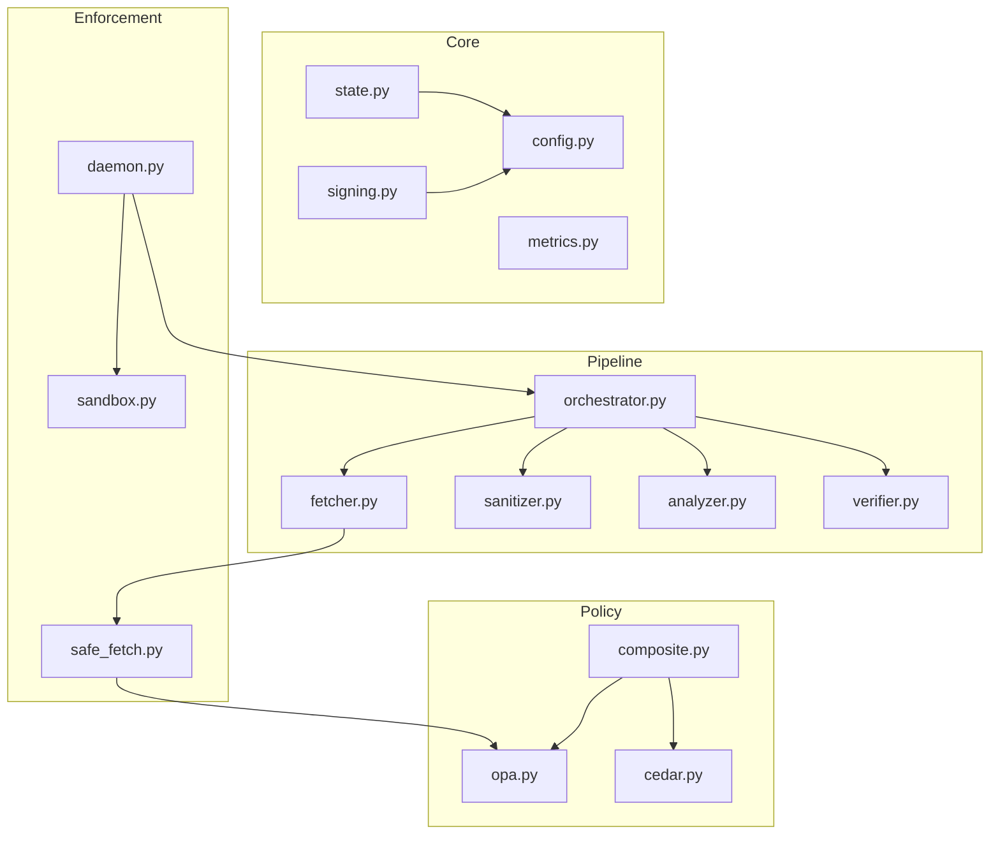

# 🧩 Strategic Analysis 04: Modularization & Streamlining

> **Purpose**: Prescriptive plan for modularizing and streamlining the Tachyon Tongs architecture to make it easier to understand, extend, and reuse.

---

## 1. Current Architecture Pain Points

### 1.1 Structural Issues

```
tachyon_tongs/
├── src/                          # 23 files, mixed concerns
│   ├── state_manager.py          # 376 lines, does signing + DB + export + task injection
│   ├── substrate_daemon.py       # FastAPI app + inline policy logic
│   ├── mcp_gateway.py            # Standalone server, duplicates tachyon_client logic
│   ├── behavior_monitor.py       # Two unrelated classes in one file
│   ├── tri_stage_pipeline.py     # The 3-stage pipeline
│   ├── adk_sentinel.py           # StateGraph orchestration
│   ├── agents/                   # Sub-agents (scout, analyst, engineer)
│   ├── cve_scraper.py            # NVD scraper + source discovery
│   └── ... 14 more files
├── scripts/                      # 16 files, mixed utilities + entry points
│   ├── sentinel.py               # CLI entry
│   ├── run_pathogen.py           # Red team runner  
│   ├── doom_ticker.py            # TUI dashboard
│   └── intel_ingest.py           # Intelligence ingestion
└── agents/                       # 3 agent manifests (airlock, deep_sky, pathogen)
```

### 1.2 Identified Problems

| Problem | Files Affected | Impact |
|---------|---------------|--------|
| **God Object** | `state_manager.py` | 376 lines handling signing, DB, export, task injection — violates SRP |
| **Mixed Concerns in src/** | All 23 files | No clear separation between core pipeline, agents, monitoring, utilities |
| **Script vs. Module Ambiguity** | `scripts/sentinel.py`, `scripts/run_pathogen.py` | Entry points mixed with utility scripts |
| **Duplicated Logic** | `mcp_gateway.py` ↔ `substrate_daemon.py` | Both handle tool routing independently |
| **Import Path Hacks** | `sys.path.insert(0, ...)` in 5+ files | Fragile module resolution |
| **Missing `__init__.py`** | Throughout `src/` | No proper Python packaging |
| **Two Monitoring Classes** | `behavior_monitor.py` | `PromptBehaviorMonitor` and `SyscallBehaviorMonitor` are unrelated, colocated |
| **Hardcoded Paths** | `state_manager.py`, `cve_scraper.py` | File paths like `"EXPLOITATION_CATALOG.md"` hardcoded as defaults |

---

## 2. Proposed Modular Architecture

### 2.1 New Directory Structure

```
tachyon_tongs/
├── pyproject.toml                    # Proper Python packaging
├── tachyon/                          # Main package (replaces src/)
│   ├── __init__.py
│   ├── core/                         # Core abstractions
│   │   ├── __init__.py
│   │   ├── config.py                 # Centralized configuration management
│   │   ├── state.py                  # StateManager (DB only, no signing)
│   │   ├── signing.py                # Cryptographic signing (extracted from state_manager)
│   │   └── metrics.py                # Metrics collection framework
│   │
│   ├── pipeline/                     # The Prophylactic Pipeline
│   │   ├── __init__.py
│   │   ├── fetcher.py                # FetcherNode (from tri_stage_pipeline)
│   │   ├── sanitizer.py              # SanitizerNode (from tri_stage_pipeline)
│   │   ├── analyzer.py               # AnalyzerNode (from tri_stage_pipeline)
│   │   ├── verifier.py               # VerifierNode (from verifier_agent)
│   │   └── orchestrator.py           # Pipeline orchestration (from adk_sentinel)
│   │
│   ├── agents/                       # Agent implementations
│   │   ├── __init__.py
│   │   ├── base.py                   # Abstract base agent class
│   │   ├── scout.py                  # Network scout (from src/agents/scout_agent)
│   │   ├── analyst.py                # Air-gapped analyst
│   │   ├── engineer.py               # Action/patcher agent
│   │   └── sentinel/                 # Sentinel-specific code
│   │       ├── __init__.py
│   │       ├── scraper.py            # CVE scraper (from cve_scraper.py)
│   │       ├── scorer.py             # Relevance scoring (NEW)
│   │       └── sources/              # Pluggable threat sources (NEW)
│   │           ├── __init__.py
│   │           ├── base.py           # ThreatSource ABC
│   │           ├── nvd.py            # NVD adapter
│   │           ├── github.py         # GitHub Advisory adapter
│   │           └── arxiv.py          # arXiv adapter
│   │
│   ├── enforcement/                  # PEP / Substrate
│   │   ├── __init__.py
│   │   ├── daemon.py                 # FastAPI substrate daemon
│   │   ├── sandbox.py                # Apple sandbox (from apple_sandbox.py)
│   │   ├── safe_fetch.py             # Safe fetch wrapper
│   │   └── intent_map.py             # Intent → domain mapping
│   │
│   ├── monitoring/                   # All monitoring
│   │   ├── __init__.py
│   │   ├── cot_monitor.py            # Chain-of-Thought loop detection
│   │   ├── syscall_monitor.py        # Behavioral drift detection
│   │   ├── execution_logger.py       # Run logging
│   │   └── evolution_logger.py       # Somatic ledger
│   │
│   ├── policy/                       # Policy engine interface
│   │   ├── __init__.py
│   │   ├── engine.py                 # Abstract policy engine
│   │   ├── opa.py                    # OPA/Rego adapter
│   │   ├── cedar.py                  # AWS Cedar adapter
│   │   └── composite.py             # Multi-engine federation (for Singularity)
│   │
│   └── protocol/                     # External protocol adapters
│       ├── __init__.py
│       ├── mcp.py                    # MCP Gateway
│       ├── client.py                 # Tachyon client library
│       └── a2a.py                    # Agent-to-Agent protocol (future)
│
├── agents/                           # Declarative agent manifests (unchanged)
│   ├── sentinel/SKILL.md             # NEW: Sentinel as declarative agent
│   ├── pathogen/SKILL.md
│   ├── airlock_resident/
│   └── deep_sky_observer/
│
├── policies/                         # Policy definitions (unchanged)
│   ├── rego/
│   ├── cedar/
│   └── shared/
│
├── scripts/                          # Entry points ONLY
│   ├── run_sentinel.py               # Sentinel entry point
│   ├── run_pathogen.py               # Pathogen entry point
│   ├── run_daemon.py                 # Substrate daemon entry point
│   └── run_dashboard.py              # Dashboard entry point
│
├── tests/                            # Mirrors tachyon/ structure
│   ├── core/
│   ├── pipeline/
│   ├── agents/
│   ├── enforcement/
│   ├── monitoring/
│   └── protocol/
│
└── docs/                             # Documentation (unchanged)
```

### 2.2 Key Refactoring Actions

#### A. Break Up `state_manager.py` (376 lines → 3 files)

| Current Method | New Location | Rationale |
|---------------|-------------|-----------|
| `_init_db`, `log_run`, `_export_run_log_markdown` | `tachyon/core/state.py` | Pure DB operations |
| `_sign_document`, `_verify_catalog_integrity`, `_init_crypto` | `tachyon/core/signing.py` | Crypto concerns |
| `inject_tasks` | `tachyon/agents/engineer.py` | Agent-specific logic |
| `log_evolution` | `tachyon/monitoring/evolution_logger.py` | Monitoring concern |
| `is_package_whitelisted` | `tachyon/policy/engine.py` | Policy concern |
| `export_catalog`, `_export_catalog_markdown` | `tachyon/core/state.py` | DB export (keep with state) |

#### B. Break Up `behavior_monitor.py` (88 lines → 2 files)

| Class | New Location |
|-------|-------------|
| `PromptBehaviorMonitor` | `tachyon/monitoring/cot_monitor.py` |
| `SyscallBehaviorMonitor` | `tachyon/monitoring/syscall_monitor.py` |

#### C. Unify Tool Routing

Currently `substrate_daemon.py` and `mcp_gateway.py` both independently route tool calls. Create a shared `ToolRouter`:

```python
# tachyon/enforcement/router.py
class ToolRouter:
    """Unified tool routing logic used by both HTTP and MCP interfaces."""
    
    def __init__(self, pipeline, sandbox, policy_engine):
        self.pipeline = pipeline
        self.sandbox = sandbox
        self.policy_engine = policy_engine
    
    async def route(self, agent_id: str, action: str, params: dict) -> dict:
        # 1. Behavioral check
        # 2. Policy check (OPA/Cedar)
        # 3. Execute via pipeline or sandbox
        ...
```

#### D. Proper Python Packaging

Replace `sys.path.insert(0, ...)` hacks with a proper `pyproject.toml`:

```toml
[project]
name = "tachyon-tongs"
version = "1.0.0"
requires-python = ">=3.11"

[tool.setuptools.packages.find]
where = ["."]

[project.scripts]
tachyon-sentinel = "scripts.run_sentinel:main"
tachyon-pathogen = "scripts.run_pathogen:main"
tachyon-daemon = "scripts.run_daemon:main"
```

---

## 3. Migration Strategy

### Phase 1: Foundation (Low Risk)
1. Create `pyproject.toml` and `tachyon/__init__.py`
2. Move files into new directory structure (symlink old locations for backwards compat)
3. Add `__init__.py` files throughout

### Phase 2: Core Extraction (Medium Risk)
1. Extract `signing.py` from `state_manager.py`
2. Split `behavior_monitor.py` into two files
3. Create `ToolRouter` and refactor `substrate_daemon.py` and `mcp_gateway.py` to use it

### Phase 3: Test Migration (Low Risk)
1. Mirror new `tachyon/` structure in `tests/`
2. Update import paths in all test files
3. Verify 100% test pass rate

### Phase 4: Agent Standardization (Medium Risk)
1. Create `agents/sentinel/SKILL.md`
2. Externalize hardcoded configs into declarative manifests
3. Create `tachyon/agents/base.py` abstract class

---

## 4. Dependency Map (What Depends on What)



---

## 5. Implementation Priority

| Task | Effort | Risk | Priority |
|------|--------|------|----------|
| Create `pyproject.toml` | Low | Low | P0 |
| Extract `signing.py` | Low | Low | P0 |
| Split `behavior_monitor.py` | Low | Low | P0 |
| Create `ToolRouter` | Medium | Medium | P1 |
| Restructure to `tachyon/` package | High | Medium | P1 |
| Migrate tests | Medium | Low | P1 |
| Create abstract `BaseAgent` | Medium | Low | P2 |
| Add `__init__.py` exports | Low | Low | P2 |

---

## 6. Expected Benefits

| Benefit | Before | After |
|---------|--------|-------|
| **Onboarding Time** | "Read all 23 files in src/" | "Read the module README matching your task" |
| **Test Isolation** | Tests import from flat namespace | Tests import from specific modules |
| **Reusability** | Copy-paste between projects | `pip install tachyon-tongs` |
| **Extension** | Modify core files | Add new module in correct directory |
| **Cognitive Load** | 23 files in one directory | 6 focused sub-packages |
